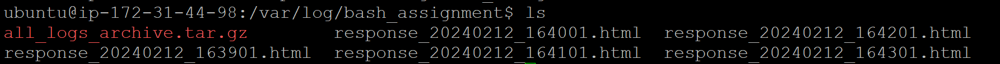

1.  _Repository Setup:_

- Fork the provided repository on Git Classroom.

  
  As forking is not available so I have created a repository on my own.

- Clone the forked repository to your local machine.

  One way to clone the repo is by copying the ssh url

  

  To clone a repository on local machine we can use the below command

> **git clone git@github.com:bibek65/My-Git-Flow.git**

    

- Set up a remote named upstream pointing to the original repository.

  For this we can use the below command

> **git remote set-url origin [url]**

- url to the original repository

2.  _Branching and Workflow:_(CLI is recommended. Do try in UI also.)

- Implement a Git branching strategy using Gitflow:

- Create a develop branch.

Initialize Gitflow:

By initializing git flow develop and main branches are created

- Implement a feature (a simple script) in a branch named feature/add-advanced-functionality.

In gitflow we can implement a feature branch as

- Merge the feature branch into the develop branch.

Merging the feature branch into develop branch can be done as

- Create a release branch named release/v1.0 from the develop branch.

Release branch can be created as

- Tag the release branch with version v1.0.

Tag is created automatically when you finish the release

- Merge the release branch into both main and develop branches.

When we finish the release it will be merged into main and develop

Branches as shown below :

I have push the changes to the remote repo as well :

3.  _Conflict Resolution:_

- Introduce a deliberate conflict in the feature/add-advanced-functionality branch.

To introduce conflict in the feature/add-advanced-functionality I have added a echo statement in example.sh file which I created earlier as shown below

Then I have created another branch feature/add-simple-functionality

And add echo statement in the same line as shown below

Now I have merged feature/add-simple-functionality into feature/add-advanced-functionality now conflict is occurred as shown below

- Resolve the conflict using Git and document the resolution steps.

You can resolve the conflict using VS Code by choosing one of the actions provided by VS. In my case I have chosen accept both changes to resolve the issue and continue the merge process.

4. _Git Submodules:_

- Add a submodule pointing to another public GitHub repository of your choice within the project.

To demonstrate git submodule I have taken a temp repo which I created in my github account . Now to add a submodule we can do this by

- Update the README to include instructions on how to initialize and update the submodule.

To show git submodule init I have just clone the repo . At first we couldnot see the files of submodules. So to do that we have to use initialize and update the submodule that can be done as shown below

5.  _Hooks and Custom Scripts:_

- Implement a custom Git post-merge hook that triggers a script (post-merge-script.sh) whenever a merge occurs in the repository.

Navigate to .git/hooks/

Create a file post-merge that will trigger the script post-merge-script.sh whenever a merge occurs

post-merge-script.sh

- Ensure the script is executable and prints a message indicating a successful merge.

To make the script executable . Below is the command

Message "Merge Successful" is shown as below

6.  _Interactive Rebase:_

- Perform an interactive rebase on the develop branch to squash three consecutive commits into a single commit.

To demonstrate this I have done 4 commits Now to squash the 3 consecutive commits

We can use interactive rebase as shown below

Here commit A is picked and 3 commits are squashed into one.

