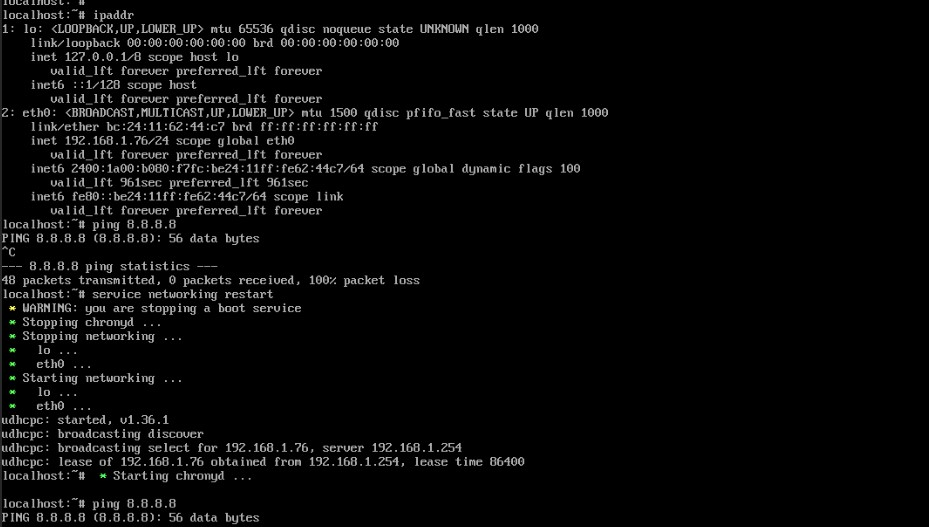
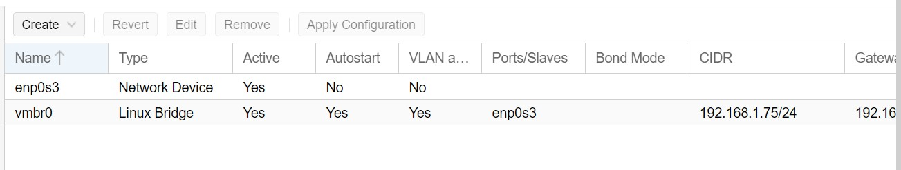

1.  _Type 2 Hypervisor Setup:_ (your choice of application)

-   Install a type-2 hypervisor into your machine

	For the Type 2 hypervisor, I've choosen VirtualBox for its user-friendly interface and compatibility with various operating systems.

2.  _Type 1 Hypervisor Setup:_ (your choice of hypervisor, recommendation Proxmox)

-   Create a VM (with nested virtualization enabled)

	Installation:

	Download the Proxmox VE ISO from the official website.

	Then I have installed it in virtual box

    

	Choose the ram cpu and disk as required

    

	You can enable the nested virtualization feature:

	From the VirtualBox Manager, select the **_Enable Nested VT-x/AMD-V_** check box on the **_Processor_** tab.

	This feature enables the passthrough of hardware virtualization functions to the guest VM.

    

	Go to network

    

	Change the adapter mode from NAT to bridge mode because we want to be able to access the proxmox machine directly through the host browser.

-   Install a type-1 hypervisor on the VM

	Complete all the setup by running the VM in virtual box.

    

	After the installation process is complete power off the machine.

    

	Remove the iso file from cd disk. And start the VM again.

    

	The proxmox hypervisor is setup successful.

3.  _Network Access:_

-   Setup network and access the type-1 hypervisor's admin panel.

	As I have changed the adapter mode from NAT to bridge mode. I am able to access the proxmox machine directly through the browser.

-   Access the hypervisor from your host/laptop

	Open Web Browser On your host/laptop, open a web browser (e.g., Chrome, Firefox, or Edge).

	Access Proxmox Web Interface: In the address bar of the web browser, enter the IP address of your Proxmox VE machine.

    

    

	Username is root and password is the password that you have given while setting up the proxmox.

4.  _Prepare to create a new VM inside type-1 hypervisor:_

-   Setup storage, network, and other resources as per the requirement.

	For testing purposes, I've selected to deploy an Alpine OS within a Type-1 hypervisor environment.

	First I have uploaded the iso image of alpine os as shown below

    

	To create the VM click on create VM button. Add the name of VM .Select the storage and other resources as shown below

    

    

    

    

    

	During the creation of VM I got error as shown below which I resolved by changing KVM hardware virtualization to No.

    

    

_Create and manage VM:_

-   Take a snapshot of that VM

	You can take snapshot of VM by navigating to snapshots tab of VM and click on take snapshot provide the name and save it.

    

-   Make changes to files/system inside the VM

	For testing I have created a directory inside home directory.

    

-   Revert the VM to the previous snapshot to reset the changes

	Now lets revert the changes made to the previous snapshot

    

	Goto snapshot and click rollback by selecting the previous snapshot

    

	Now the directory created inside the home directory is no more there.

    

5.  _Setup another Type 1 Hypervisor:_

-   Install another type-1 hypervisor as described in previous steps (1-5).

	I have just cloned the hypervisor

    

	Changed the ip address by editing from /etc/network/interfaces

    

6.  _Access both Type 1 hypervisors from host PC_

    

7.  _Internet connectivity:_

-   Both type-1 hypervisors have connectivity to the internet

	I have ping the google.com from both type-1 hypervisors and it is pinging successfully as shown below

    

-   VMs inside of hypervisors also have connectivity to the internet

	There's an issue with internet access from within the VMs, despite obtaining DHCP-assigned IP addresses. Despite multiple attempts to troubleshoot, I couldnot find solution. Internet connectivity within the VMs is currently restricted, hindering their ability to ping beyond the local network. I'm seeking guidance and feedback to resolve this  issue.

	I have included screenshots of the network interfaces for both Proxmox and the VM. If any adjustments are necessary, kindly provide feedback on the configurations. 

	

	

	

